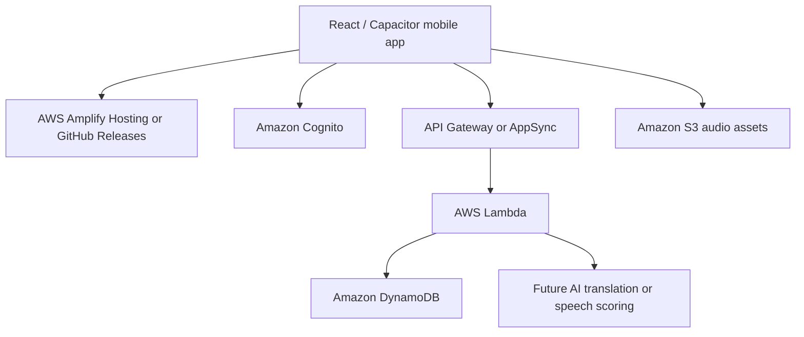

# AWS Prototype Plan

This document explains how Amigo can be presented as AWS-ready while staying safe and low-cost during the hackathon prototype.

## Current Prototype Mode

The app runs locally and stores progress on the device through `src/services/amigoCloud.ts`.

Current saved data:

- XP
- Daily streak
- Completed lessons
- Profile name, username, bio, and photo
- Settings

The adapter currently uses browser storage, but the rest of the app talks to it as if it were a sync layer.

## Recommended AWS Architecture



## Service Mapping

| App feature | Prototype now | AWS version later |
| --- | --- | --- |
| Login / sign up | Local no-op buttons | Amazon Cognito |
| XP and streaks | Browser storage | DynamoDB |
| Profile data | Browser storage | DynamoDB |
| Audio files | Bundled public files | S3 or Amplify hosted files |
| Translator | Local dictionary | Lambda calling translation model/API |
| Speaking check | Browser speech recognition | Native speech plugin or cloud scoring |
| Frontend hosting | Vite dev server / GitHub | Amplify Hosting |

## Free-Tier Friendly Scope

For the hackathon, keep AWS usage limited to:

- Amplify Hosting for the web demo
- Cognito for sign-in only if needed
- DynamoDB for tiny user progress records
- S3 for small audio files if not bundled in the app

Avoid for now:

- Always-on EC2 servers
- SageMaker endpoints
- GPU model hosting
- Large AI translation models running 24/7
- SMS authentication
- WAF

## Suggested DynamoDB Tables

### `AmigoUsers`

```txt
pk: USER#<userId>
name
username
bio
photoUrl
followers
following
createdAt
updatedAt
```

### `AmigoProgress`

```txt
pk: USER#<userId>
sk: LANGUAGE#bisaya
xp
streak
lastPracticeDate
completedLessonIds
pronunciationAttempts
updatedAt
```

### `AmigoLeaderboard`

```txt
pk: LANGUAGE#bisaya
sk: XP#<score>#USER#<userId>
name
username
xp
streak
```

## Environment Variables

The prototype includes `.env.example`.

```txt
VITE_AMIGO_SYNC_MODE=local-prototype
```

Later, when AWS resources exist:

```txt
VITE_AMIGO_SYNC_MODE=aws-amplify
VITE_AWS_REGION=ap-southeast-1
VITE_COGNITO_USER_POOL_ID=
VITE_COGNITO_CLIENT_ID=
VITE_AMIGO_API_URL=
```

## Security Notes

- Do not commit AWS access keys.
- Do not put secrets in Vite `VITE_*` variables because frontend variables are visible to users.
- Use Cognito for user identity.
- Use IAM roles and backend APIs for protected DynamoDB writes.
- Add AWS Budgets alerts before deploying anything.

## Presentation Line

"For the prototype, Amigo saves progress locally through an AWS-ready sync adapter. The production path is Amplify for hosting, Cognito for authentication, DynamoDB for XP/streak/profile data, S3 for lesson audio, and Lambda/API Gateway for future AI translation or pronunciation scoring."
